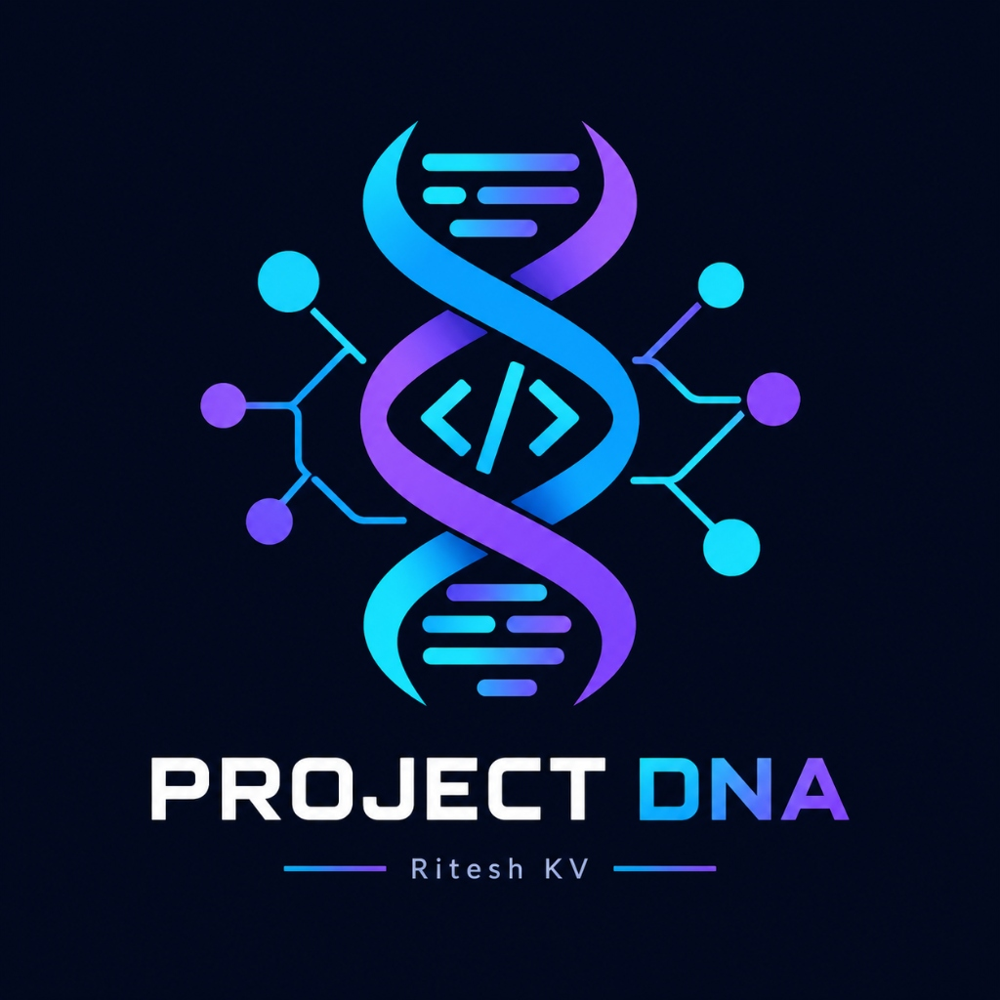

<p align="center">
  
</p>

# 🧬 Project DNA

> **Understand your entire codebase through a living project architecture map.**

Project DNA is a developer tool for Visual Studio Code that performs local static analysis on your codebase to generate an interactive, living architecture map. It analyzes structural hierarchy, code relationships, architectural roles, technologies, dependencies, configuration files, server APIs, and environment variables.

---

## 🔒 Privacy & Security First

* **100% Local Static Analysis:** All parsing and dependency graph algorithms run entirely on your local machine inside VS Code.
* **No External APIs or Telemetry:** Project DNA does not require external AI services, API keys, or cloud subscriptions for core codebase analysis.
* **Zero Code Uploads:** Your proprietary source code and files never leave your workstation.
* **Environment Secret Protection:** Secret values in `.env` files are never extracted, stored, logged, or displayed. Only variable names and scope (public vs private) are audited.

---

## ✨ Key Features & Analysis Engines

### 1. 📊 Project Overview Command Center
* **Living Architecture Dashboard:** Synthesizes file counts, directory tree metrics, architectural layers, and technology stacks into a unified summary.
* **Structural Hotspots:** Instantly flags high fan-in foundational modules and high fan-out orchestrators.
* **Cycle & Unresolved Counters:** Tracks circular dependencies and unresolved imports.
* **Scan Warnings:** Non-intrusively displays any non-fatal parsing notes or oversized files.

### 2. 📁 Workspace Structure & File Categorizer
* **Intelligent File Classification:** Automatically classifies files into `source`, `test`, `config`, `documentation`, `style`, `asset`, `lockfile`, and `data`.
* **Interactive File Tree:** Browse files with instant search and direct jump-to-file in the editor.
* **Deterministic Ignore Engine:** Ignores `node_modules`, `.git`, build outputs, cache directories, and minified bundles.

### 3. 🏛️ Architecture & Role Classifier
* **Architectural Tier Grouping:** Groups modules into Presentation, Routing, Application, Domain, Services, Data Access, Infrastructure, Configuration, and Testing layers.
* **Role Classification:** Classifies modules into Entry Points, Pages, Routes, Layouts, Components, Custom Hooks, Contexts, Services, Models, Repositories, Utilities, and more.
* **High-Level Interactions:** Categorizes relationships such as `renders`, `uses`, `calls`, `tests`, and `configures`.

### 4. 🕸️ Interactive Architecture Graph
* **Canvas Visualization:** Interactive pan/zoom graph with auto-fit viewport.
* **Deterministic Tier Layout:** Structured multi-row grid layout with collision-free coordinates.
* **Neighborhood Highlighting:** Hover or select any node to isolate its incoming and outgoing dependencies.
* **Cycle Highlighting:** Cycles are clearly highlighted with cycle length badges.
* **Side Details Drawer:** Inspect role confidence, layers, incoming/outgoing connections, and file paths.

### 5. 🔬 Evidence-Based Technology Detection
* **Multi-Ecosystem Detection:** Identifies languages, frameworks (Next.js, React, Vue, Express, FastAPI, Flask, Spring Boot), build tools, and databases.
* **Verifiable Evidence:** Provides exact file and manifest evidence for every detected technology.

### 6. 📦 Code Dependencies & Import Graph
* **Deep Import Resolution:** Supports TypeScript/JavaScript named and default imports, dynamic imports, CommonJS `require()`, JSX/TSX, and Python imports.
* **Generic Path Aliases:** Fully resolves TypeScript `@/*`, `~/*`, and custom path aliases defined in `tsconfig.json` or `jsconfig.json`.
* **Cycle Detection:** Tarjan algorithm detects direct ($A \to B \to A$) and multi-hop ($A \to B \to C \to A$) dependency cycles.
* **External Packages Catalog:** Aggregates and ranks npm/pip packages by usage frequency.

### 7. 🌐 API & Server Route Catalog
* **Next.js App & Pages Router:** Automatically derives REST endpoints from `route.ts` handlers and `pages/api` files.
* **Express, Python & Java:** Indexes routes from Express (`app.get`, `router.post`), FastAPI/Flask (`@app.get`), and Spring Boot (`@RestController`, `@GetMapping`).
* **HTTP Method Filters:** Clean filter bar for `GET`, `POST`, `PUT`, `PATCH`, `DELETE`, and other methods.

### 8. ⚙️ Configuration & Manifest Auditor
* **Categorized Project Manifests:** Categorizes configs across package managers, compilers, frameworks, bundlers, linters, formatters, and deployment platforms.

### 9. 🔐 Environment Variable Reference Auditor
* **Declared vs Referenced Status:** Identifies variables that are `declared_and_referenced`, `declared_only` (unused), or `referenced_only` (missing definition).
* **Public vs Private Scope:** Detects public client prefixes (`NEXT_PUBLIC_`, `VITE_`, `REACT_APP_`) vs private server variables.

### 10. 🌿 Local Git Repository Integration
* **Repository Status:** Displays active branch, HEAD commit hash, configured remote origin, and working tree status locally from `.git`.

---

## 🚀 How to Use

Project DNA is installed directly from the Visual Studio Code Marketplace.

1. **Install Project DNA** from the VS Code Marketplace (Search for `Project DNA` in the Extensions view).
2. **Open any project or workspace** in VS Code.
3. **Open the Project DNA view** by clicking the **🧬 Project DNA** icon in the Activity Bar.
4. **Open the Dashboard** by clicking the dashboard action or pressing `Ctrl+Shift+P` (`Cmd+Shift+P` on macOS) and running:
   ```
   Project DNA: Open Dashboard
   ```
5. **Click "Analyze Project"** in the navigation header or overview screen.
6. **Wait for the analysis to complete** (analyses run entirely locally in seconds).
7. **Explore the available sections** to understand your project's architecture, dependencies, and structure.

---

## 🔍 What You Can Explore

### 📊 Overview
Get an instant command center summary of your project — including file counts, architectural layers, key technologies, structural hotspots, circular dependencies, and unresolved imports.

### 🏛️ Architecture
Inspect your project's architectural structure categorized into standard tiers (Presentation, Routing, Application, Domain, Services, Infrastructure, Configuration) and module roles (Pages, Components, Custom Hooks, Contexts, Services, Models, Repositories).

### 📦 Dependencies
Understand internal import relationships between files and modules, inspect fan-in / fan-out metrics, browse external package usage, and detect direct or multi-hop dependency cycles.

### 🕸️ Graph
Visualize your entire codebase through an interactive, zoomable architecture graph with layer grouping, cycle highlighting, and neighborhood dependency isolation.

### 🌐 APIs
Explore detected server API routes and HTTP endpoints across supported frameworks (Next.js App & Pages Router, Express, FastAPI, Flask, and Spring Boot) with interactive HTTP method filters.

### ⚙️ Configuration
Audit all categorized project manifests and configuration files across package managers, compilers, bundlers, linters, and deployment targets.

### 🔬 Technology
Identify evidence-backed programming languages, frameworks, styling solutions, databases, and build tools detected across your workspace.

### 🔐 Environment Variables
Audit referenced environment variables and their scopes (public client vs private server) safely without extracting or logging sensitive secret values.

---

## 🔗 Links & Repository

* **GitHub Repository:** [https://github.com/codeliferitesh/project-dna](https://github.com/codeliferitesh/project-dna)
* **Issue Tracker:** [https://github.com/codeliferitesh/project-dna/issues](https://github.com/codeliferitesh/project-dna/issues)
* **Marketplace:** [https://marketplace.visualstudio.com/items?itemName=stacksolve.project-dna](https://marketplace.visualstudio.com/items?itemName=stacksolve.project-dna)

---

## 📄 License

This project is licensed under the MIT License (refer to the included LICENSE file).

